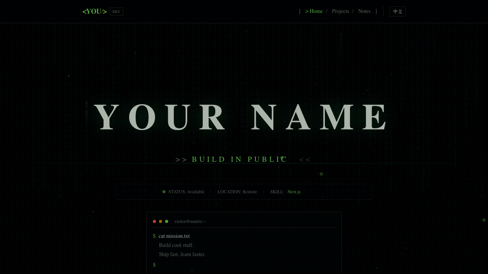

# Matrix Theme

Cyberpunk/Matrix-inspired portfolio template with terminal aesthetics, animated backgrounds, and CRT effects.

**[Live Demo](https://neoxue-ai.github.io/matrix-theme/)**



**Features:**
- Matrix rain canvas animation
- ASCII starfield background
- Boot sequence animation
- Terminal-style navigation
- Multi-language support (EN/ZH)
- Dark mode by default

**Stack:**
- Next.js 16
- Tailwind CSS 4
- TypeScript

**Quick Start:**

```bash
pnpm install
pnpm dev
```

Edit `template.config.ts` to customize content.
